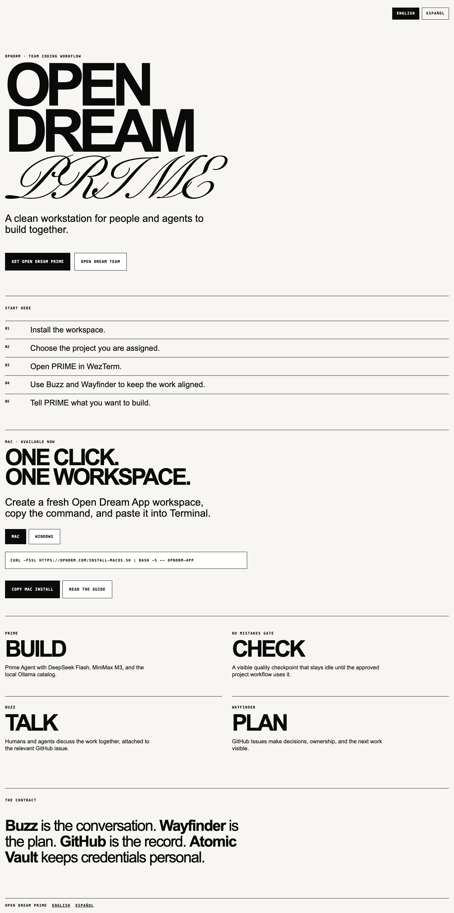

<div align="center">

# OPEN DREAM<br>PRIME

`ONE CLICK · ONE CALM WORKSPACE · MAC + WINDOWS`

**The Open Dream coding workspace for people and agents.**

[Open OPNDRM.com](https://opndrm.com) · [English guide](https://opndrm.com/guide/) · [Guía en español](https://opndrm.com/es/guide/) · [Team access](https://opndrm.com/admin)



</div>

---

## START HERE

Open Dream Prime creates a fresh **OPNDRM APP** workspace on the Desktop. The public installer is intentionally simple:

```
CHOOSE MAC OR WINDOWS → COPY ONE COMMAND → OPEN PRIME → BUILD
```

The installer prepares the shared tools and opens a named PRIME workspace. Daily work does **not** rerun the installer: open the saved workspace for the app you need.

The public **OPNDRM APP** lane never starts GitHub device authorization. For private **ADAM** and **FRNKLY.ONE** lanes, GitHub CLI owns one personal web/device authorization before cloning: the teammate signs in with their own GitHub account and enters the one-time code only at GitHub’s official device page. The installer displays the authenticated username and verifies read access to the selected repository before cloning. It never uses an Open Dream shared login, repository-administrator role, token, or credential. If access is missing, the repository owner invites that personal account as a normal collaborator with the needed repository access; **FRNKLY.ONE requires that invitation**.

The canonical FRNKLY.ONE Rust checkout is [`opndrm/Frnkly.one`](https://github.com/opndrm/Frnkly.one.git). The installer keeps its local workspace and session named **FRNKLY.ONE** while cloning that repository.

## THE WORKSPACE

| Surface | Purpose |
| --- | --- |
| **PRIME** | The main Prime Agent session for one bounded work card. |
| **NO MISTAKES GATE** | A visible quality checkpoint. It remains inactive until the approved repository workflow uses it. |
| **BUZZ** | The conversation space for people and agents. Never put credentials there. |
| **WAYFINDER** | GitHub Issues: the plan, owner, decisions, and next work. |

GitHub remains the record for code, branches, reviews, and the work history.

## WHAT GETS INSTALLED

| System | Purpose |
| --- | --- |
| **WezTerm + HERDR** | The persistent local terminal workspace. |
| **Prime Agent + Ollama** | The coding harness and local model catalog. |
| **No Mistakes** | Installed as an inactive quality gate. |
| **Buzz** | Human-and-agent coordination. |
| **Git + GitHub CLI** | Version control and team collaboration. |
| **Atomic Vault + CBF Remote** | The employee’s personal credential boundary. Trust remains an owner action. |

DeepSeek Flash, MiniMax M3 when installed, and every locally installed Ollama model are available to PRIME.

The installer treats a successful `prime-agent package install` as the package-install result, then verifies that Prime Agent still responds. The package loads when Prime Agent starts or after `/reload`; a running Prime Agent does not need to list the package before setup continues.

## OPEN A WORKSPACE

Use the published `/opndrm-prime` skill in English or Spanish:

| Ask PRIME | Opens |
| --- | --- |
| `Open OPNDRM APP` / `abre OPNDRM APP` | The fresh Desktop workspace. |
| `Open ADAM` / `abre ADAM` | The saved ADAM workspace. |
| `Open FRNKLY.ONE` / `abre FRNKLY.ONE` | The saved FRNKLY.ONE workspace. |
| `Open the last ADAM session` | That app’s most recent named HERDR session. |

The same named-session behavior is designed for Mac and Windows. Windows remains a first-device preview until it passes a real Windows-device health check.

## TEAM ACCESS

The public page creates new **OPNDRM APP** workspaces. Existing team projects, including ADAM and FRNKLY.ONE, are available only through the protected **Open Dream Team** page after team access is verified. Each team app has its own one-click installer, purpose, and start instructions.

## SAFETY BOUNDARIES

- The installer never overwrites an existing workspace.
- No Mistakes is installed but never started by onboarding.
- Atomic Vault credentials and trust stay personal; no credential is placed in this repository.
- A person’s project workspace, session, branch, and credentials remain separate from every other app and teammate.

---

<div align="center">

`OPNDRM · BUILD CALM · KEEP THE TEAM ALIGNED`

</div>
